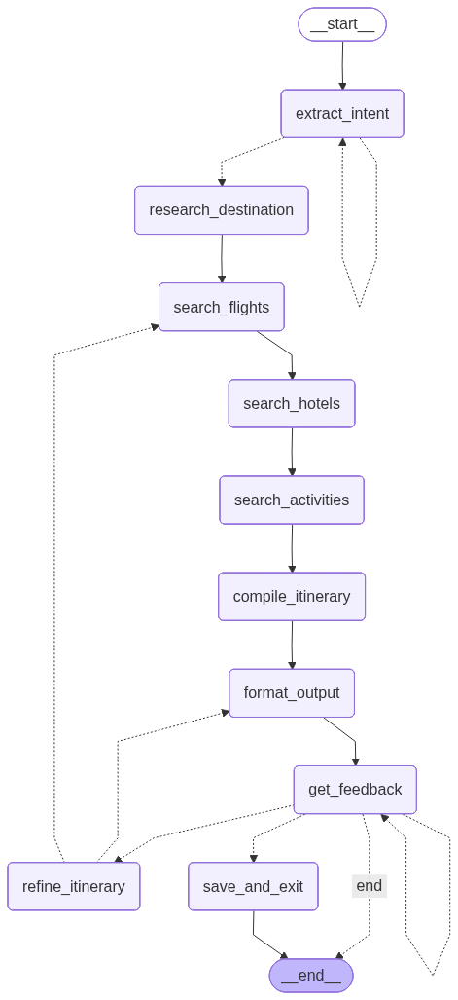

# 🌍 Lazy Tourist - AI Travel Planning Agent

An interactive, multi-agent travel planning system that creates personalized, end-to-end travel itineraries through natural conversation using LangGraph and GPT-4o-mini.

## 🎯 Features

- **🎨 Beautiful Web UI**: Modern Streamlit interface with chat-like conversation
- **💬 Interactive Conversation**: Describe your trip, review results, and request changes in natural dialogue
- **🔄 Iterative Refinement**: Perfect your itinerary through multiple rounds of feedback
- **🗣️ Natural Language Understanding**: Describe your trip in plain English
- **🤖 Multi-Agent Architecture**: Specialized agents for different aspects of trip planning
- **📊 Full-Screen Itinerary Display**: Expandable/minimizable full-screen view once your itinerary is ready
- **🌐 Real-time Data**: Mocked flight, hotel, and activity APIs (ready for real API integration)
- **📅 Comprehensive Itineraries**: Day-by-day plans with flights, hotels, and activities
- **💰 Budget Tracking**: Automatic budget breakdown and optimization
- **📍 Destination Intelligence**: Visa requirements, safety tips, local customs, and more
- **📥 Beautiful Output**: Markdown-formatted itineraries you can download and share

## 🏗️ Architecture

The Lazy Tourist system provides two modes of interaction - a **Streamlit Web UI** and a **Command-Line Interface** - both built on the same LangGraph multi-agent architecture.

---

### 🎨 Streamlit Web UI Architecture

```
┌─────────────────────────────────────────────────────────────┐
│                     streamlit_app.py                        │
│                   (Main Orchestrator)                       │
│                                                             │
│  • Page configuration                                       │
│  • CSS application                                          │
│  • Layout coordination                                      │
│  • Component assembly                                       │
└────────┬──────────────────┬──────────────────┬──────────────┘
         │                  │                  │
         ▼                  ▼                  ▼
    ┌─────────┐      ┌───────────┐      ┌──────────┐
    │ ui/     │      │ ui/       │      │ ui/      │
    │ session │      │ components│      │ styles   │
    │         │      │           │      │          │
    │ Session │      │ UI        │      │ CSS      │
    │ State   │      │ Elements  │      │ Theming  │
    │ Mgmt    │      │           │      │          │
    └────┬────┘      └─────┬─────┘      └──────────┘
         │                 │
         │                 │ User Interaction
         │                 ▼
         │           ┌───────────┐
         │           │ ui/       │
         │           │ handlers  │
         │           │           │
         │           │ Business  │
         │           │ Logic     │
         └───────────┤           │
                     └─────┬─────┘
                           │
                           ▼
                  ┌─────────────────┐
                  │   graph.py      │
                  │                 │
                  │  LangGraph      │
                  │  Orchestrator   │
                  └────────┬────────┘
                           │
                           ▼
                  ┌─────────────────┐
                  │  Multi-Agent    │
                  │   Workflow      │
                  │                 │
                  │  • Agents       │
                  │  • Tools        │
                  │  • State        │
                  └─────────────────┘
```

**Key Components:**
- **streamlit_app.py**: Main entry point, assembles UI components
- **ui/session.py**: Manages session state lifecycle
- **ui/components.py**: Reusable UI elements (chat, header, sidebar)
- **ui/handlers.py**: Bridges user interactions with LangGraph
- **ui/styles.py**: Dark theme CSS styling
- **graph.py**: LangGraph orchestration with checkpointing

---

### 💻 Interactive CLI Architecture

```
┌─────────────────────────────────────────────────────────────┐
│                       main.py                               │
│                  (CLI Orchestrator)                         │
│                                                             │
│  • User input/output                                        │
│  • Session management                                       │
│  • State initialization                                     │
│  • Streaming coordination                                   │
│  • Graph execution control                                  │
└─────────────────────────┬───────────────────────────────────┘
                          │
                          ▼
                  ┌─────────────────┐
                  │   graph.py      │
                  │                 │
                  │  LangGraph      │
                  │  Orchestrator   │
                  └────────┬────────┘
                           │
                           ▼
                  ┌─────────────────┐
                  │  Multi-Agent    │
                  │   Workflow      │
                  │                 │
                  │  • Agents       │
                  │  • Tools        │
                  │  • State        │
                  └─────────────────┘
```

**Key Components:**
- **main.py**: Direct terminal interaction with agent workflow
- **graph.py**: Same LangGraph orchestration (shared with Streamlit)
- **Checkpointing**: Uses thread_id for resumable conversations
- **Streaming**: Real-time updates printed to terminal

---

### 🔄 Agent Workflow (Shared by Both Modes)



The graph shows the complete multi-agent workflow with intelligent routing and feedback loops.

### 🤖 Agent Responsibilities

- **Intent Extractor**: Parses natural language, extracts preferences
- **Destination Research**: Researches visa, weather, safety, tips
- **Flight Search**: Finds optimal flight options
- **Hotel Search**: Searches accommodations
- **Activity Research**: Discovers attractions & experiences
- **Itinerary Compiler**: Compiles day-by-day plan
- **Formatter**: Creates beautiful markdown output
- **Feedback Handler**: Uses LLM to intelligently analyze user feedback and decide:
  - **CLARIFY**: Answer basic questions (loops back showing only assistant response)
  - **REFINE**: Process itinerary modification requests
  - **SAVE**: Detect satisfaction and save itinerary
- **Refinement Agent**: Applies changes based on feedback and determines if new searches are needed

## 📁 Project Structure

```
lazy-tourist/
├── streamlit_app.py             # Streamlit Web UI (recommended) - Main entry point
├── main.py                      # Command-line interface
├── graph.py                     # LangGraph orchestration with feedback loop & visualization
├── requirements.txt             # Python dependencies
├── README.md                    # This file
│
├── docs/                        # Documentation
│   └── STREAMLIT_LANGGRAPH_INTEGRATION.md  # Streamlit-LangGraph integration guide
│
├── agents/                      # Agent implementations
│   ├── __init__.py
│   ├── state.py                 # Shared state schema
│   ├── intent_extractor.py     # Parses user intent
│   ├── search_agents.py        # Flight/hotel/activity search
│   ├── itinerary_compiler.py   # Compiles final itinerary
│   └── feedback_handler.py     # Handles user feedback and refinement
│
├── ui/                          # Streamlit UI components (modular structure)
│   ├── __init__.py
│   ├── styles.py                # CSS styling for dark theme
│   ├── session.py               # Session state management
│   ├── components.py            # Reusable UI components (header, sidebar, chat, etc.)
│   └── handlers.py              # Event handlers and processing logic
│
├── tools/                       # Tool definitions with mocked APIs
│   ├── __init__.py
│   ├── flight_tools.py         # Flight search (mocked)
│   ├── hotel_tools.py          # Hotel search (mocked)
│   ├── activity_tools.py       # Activity & destination research (mocked)
│   └── itinerary_tools.py      # Itinerary management tools
│
├── mocks/                       # Mock data for APIs
│   ├── __init__.py
│   ├── flight_data.py          # Flight mock data
│   ├── hotel_data.py           # Hotel mock data
│   └── activity_data.py        # Activity mock data
│
├── data/                        # External API configurations
│   ├── __init__.py
│   ├── apis.py                 # API endpoint definitions
│   └── README.md               # API integration guide
│
├── utils/                       # Utility functions
│   ├── __init__.py
│   ├── api_client.py           # API client utilities
│   ├── pdf_writer.py           # PDF generation utilities
│   └── image_utils.py          # Image processing utilities (dark theme conversion)
│
├── outputs/                     # Saved itineraries
│
└── tests/                       # Test files
    ├── __init__.py
    ├── test_agent.py           # Unified test suite
    └── README.md               # Testing guide
```

## 🚀 Quick Start

### 1. Installation

```bash
# Clone or navigate to the project directory
cd lazy-tourist

# Create a virtual environment (recommended)
python -m venv venv
source venv/bin/activate  # On Windows: venv\Scripts\activate

# Install dependencies
pip install -r requirements.txt
```

### 2. Configuration

Create a `.env` file in the project root:

```bash
OPENAI_API_KEY=your-openai-api-key-here
```

### 3. Run the Agent

**🎨 Streamlit Web UI (Recommended)**:
```bash
streamlit run streamlit_app.py
```

This will open a beautiful web interface in your browser at `http://localhost:8501` with:
- Chat-like conversation interface
- Full-screen itinerary display (expandable/minimizable)
- Trip details sidebar
- Example queries to get started quickly (with clipboard copy buttons)
- Download itinerary as Markdown

**💻 Command Line Interface**:
```bash
# Interactive Mode
python main.py

# With Graph Visualization
python main.py --show-graph

# With Graph Visualization (Dark Mode)
python main.py --show-graph --dark-graph

# Show Help Guide
python main.py --help-guide
```

## 💬 Example Conversation

Here's what a typical interaction looks like:

```
✈️  Describe your dream trip: Plan a 5-day trip to Paris for 2, budget $3000, love food

[Agent creates itinerary...]

📄 YOUR CURRENT ITINERARY
[...full itinerary displayed...]

💬 Your feedback: What's the weather like in Paris in July?
🤔 Analysis: User is asking a basic information question about weather
💭 Paris in July is typically warm and pleasant, with average temperatures around 20-25°C (68-77°F)...
(Itinerary remains visible below)

💬 Your response: Thanks! Add more food activities

🤔 Analysis: User wants to modify the itinerary by adding food activities
🔄 I'll add more culinary experiences to your itinerary...

[Agent updates itinerary with more food tours]

📄 YOUR CURRENT ITINERARY
[...updated itinerary displayed...]

💬 Your feedback: Perfect! This looks great

🤔 Analysis: User is expressing satisfaction and wants to save
✅ Great! Saving your itinerary...

✅ Itinerary saved to: outputs/itinerary_Paris_20251101_143227.pdf
```

**Key Features:**
- **Intelligent Decision Making**: The LLM automatically determines if you're asking a question (clarification), requesting changes (refinement), or expressing satisfaction (save)
- **Smart Looping**: Basic questions loop back to show just the assistant's answer (no itinerary clutter)
- **Natural Conversation**: No need to use specific keywords - the assistant understands your intent

### Example Queries to Start With

1. **Classic European Vacation**: "Plan a 5-day trip to Paris for 2 adults in July, budget $3,000, love food and history"
2. **Tropical Getaway**: "4-day Bali getaway for 2 people, budget $2,500, love beaches and culture"
3. **Family Adventure**: "One week Tokyo trip for family of 3 (2 adults, 1 child), budget $5,000, interested in technology and culture"
4. **Budget Trip**: "Cheap 3-day Paris trip for 1 person, $1000 budget, interested in museums"

## 📊 What You'll Get

The agent creates a comprehensive itinerary including:

- ✈️ **Flight Options**: Airlines, timings, prices, layovers
- 🏨 **Hotel Recommendations**: Star ratings, amenities, reviews, location
- 🎯 **Activities**: Day-by-day activities matching your interests
- 💰 **Budget Breakdown**: Detailed costs for flights, hotels, activities, meals
- 📍 **Destination Intel**: Visa requirements, weather, safety tips, local customs
- 📅 **Day-by-Day Plan**: Structured itinerary with timing and costs

All formatted in beautiful, shareable Markdown!

## 🛠️ Technical Details

### State Management

The system uses a `TravelState` TypedDict that flows through all agents:

```python
class TravelState(TypedDict):
    messages: List[BaseMessage]
    user_query: str
    preferences: TravelPreferences
    flights: List[FlightOption]
    hotels: List[HotelOption]
    activities: List[Activity]
    daily_itinerary: List[DayPlan]
    budget: BudgetBreakdown
    # ... more fields
```

### External APIs

The application uses **external mock APIs** for realistic data:
- **Flight searches** - Outbound and return flights with pricing and routes
  - Query params: `origin`, `destination`, `departure_date`/`return_date`, `passengers`
- **Hotel availability** - Hotels with ratings, amenities, and prices
  - Query params: `location`, `check_in`, `check_out`, `guests`
- **Activities and attractions** - Tourist activities and points of interest
  - Query params: `location`, `interests`, `max_price`
- **Destination information** - Travel tips, visa info, safety guidelines
  - Query params: `location`

All API calls append relevant query parameters directly to the URL for demo purposes, showing proper API usage patterns. The query parameters are visible in console output (e.g., `https://api.example.com?origin=NYC&destination=Paris&passengers=2`).

**Ready for Real Integration**: The tool interfaces are designed to easily swap mock APIs with real API services like:
- Amadeus API (flights & hotels)
- Skyscanner API
- Google Places API (activities)
- OpenWeather API
- And more!

### LLM Integration

Uses **gpt-4o-mini** for:
- Intent extraction from natural language
- Intelligent agent reasoning
- Natural language generation
- **Feedback analysis and routing**: Automatically classifies user input as clarification questions, refinement requests, or save commands

## 🎨 Customization

### Modifying the Agent Flow

Edit `graph.py` to change the agent orchestration, add new agents, or modify the workflow.

### Graph Visualization

The agent workflow can be visualized as a graph using the `visualize_graph()` function:

```python
from graph import create_travel_agent_graph, visualize_graph

app = create_travel_agent_graph()

# Light mode (default)
visualize_graph(app, "travel_agent_graph.png")

# Dark mode (requires Pillow)
visualize_graph(app, "travel_agent_graph_dark.png", dark_mode=True)
```

The dark mode option inverts colors to create a dark theme suitable for dark backgrounds. This uses the `convert_to_dark_theme()` utility function from `utils.image_utils`. Requires the `Pillow` library, which is included in `requirements.txt`.

**Command Line:**
```bash
# Show graph visualization
python main.py --show-graph

# Show dark mode graph
python main.py --show-graph --dark-graph
```

## 🧪 Testing

A unified test suite is provided:

```bash
# Run all tests
python tests/test_agent.py

# Run specific test scenarios
python tests/test_agent.py basic      # Basic flow test
python tests/test_agent.py refine     # Test with refinements
python tests/test_agent.py missing    # Test missing information prompts
python tests/test_agent.py partial    # Test partial information handling
```

## 📝 Output Example

The agent generates detailed markdown itineraries like:

```markdown
# 🌍 Your Personalized Travel Itinerary
## Paris Adventure

---

## 📋 Trip Overview
**Destination:** Paris
**Dates:** 2025-07-15 to 2025-07-20
**Duration:** 5 days
**Travelers:** 2 adults, 0 children
**Budget:** $3000

## ✈️ Flight Details
**Outbound Flight:**
- Airline: Air France AF007
- Route: JFK → CDG
- Price: $1,300 ($650/person)
...
```

## 🔧 Dependencies

- **langchain**: Framework for LLM applications
- **langgraph**: State machine for multi-agent systems
- **langchain-openai**: OpenAI integration
- **python-dotenv**: Environment variable management

## 🎨 Streamlit Web UI

The project includes a beautiful Streamlit web interface with:

### Key Features
- **💬 Chat Interface**: Natural conversation with the AI
- **📄 Full-Screen Itinerary**: Expandable/minimizable full-screen itinerary display once ready
- **📊 Trip Dashboard**: Sidebar with current trip details
- **💡 Example Queries**: Quick-start buttons for common requests with clipboard copy functionality
- **📥 Download**: Export itinerary as Markdown
- **🔄 Reset**: Start new planning sessions easily

### Quick Start
```bash
streamlit run streamlit_app.py
```

### Architecture & Integration
For a detailed explanation of how Streamlit integrates with LangGraph, including:
- Module breakdown (components, handlers, session, styles)
- State management and synchronization
- Integration flow and checkpointing
- Best practices

See **[Streamlit-LangGraph Integration Guide](docs/STREAMLIT_LANGGRAPH_INTEGRATION.md)** for comprehensive documentation.

## 📄 License

This project is for educational and demonstration purposes.

## 🎉 Acknowledgments

Built with:
- LangGraph for multi-agent orchestration
- OpenAI GPT-4o-mini for intelligent reasoning
- LangChain for LLM application framework

---

**Happy Travels! 🌍✈️🏖️**

