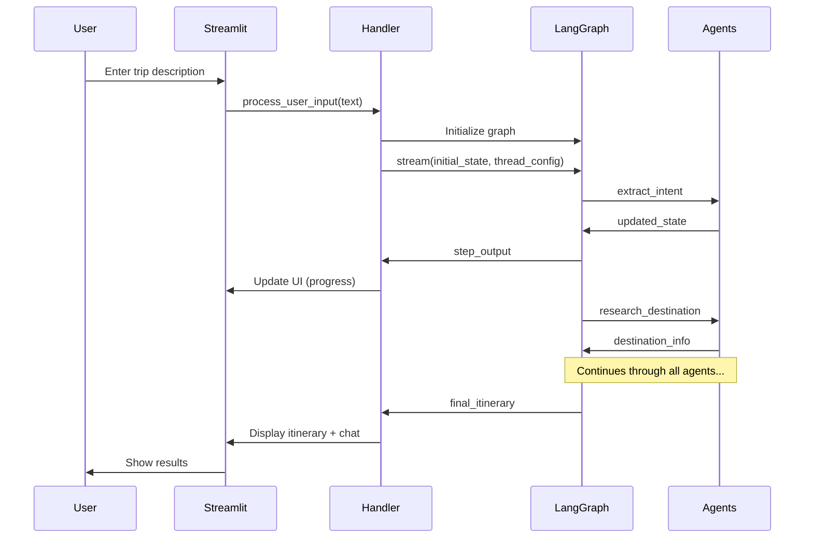
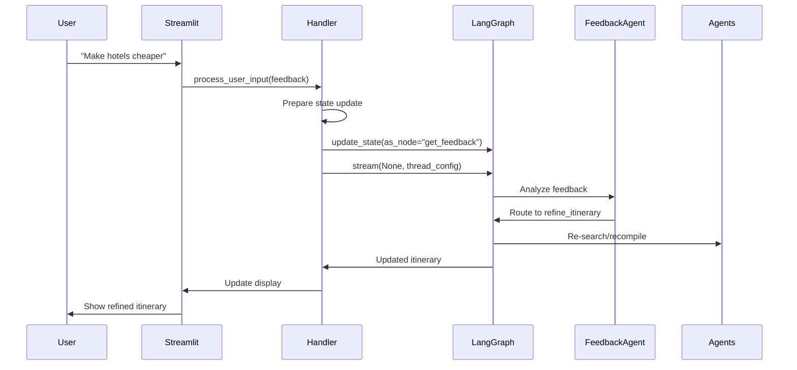

# Streamlit-LangGraph Integration Architecture

## Table of Contents
1. [Overview](#overview)
2. [Architecture Diagram](#architecture-diagram)
3. [Module Breakdown](#module-breakdown)
4. [Integration Flow](#integration-flow)
5. [State Management](#state-management)
6. [Key Integration Points](#key-integration-points)
7. [Best Practices](#best-practices)

---

## Overview

The Lazy Tourist travel planning application combines **Streamlit** (web UI framework) with **LangGraph** (multi-agent orchestration framework) to create an interactive, conversational AI travel planner. This integration enables users to plan trips through a chat interface while LangGraph manages complex multi-agent workflows behind the scenes.

### Key Integration Benefits
- **Stateful Conversations**: LangGraph's checkpointing + Streamlit's session state enable persistent conversations
- **Streaming Updates**: Real-time progress indicators as agents execute
- **Interactive Feedback Loop**: Users can refine itineraries conversationally
- **Clean Separation**: UI logic separated from business logic

---

## Architecture Diagram

```
┌─────────────────────────────────────────────────────────────┐
│                     streamlit_app.py                        │
│                   (Main Orchestrator)                       │
│                                                             │
│  • Page configuration                                       │
│  • CSS application                                          │
│  • Layout coordination                                      │
│  • Component assembly                                       │
└────────┬──────────────────┬──────────────────┬──────────────┘
         │                  │                  │
         ▼                  ▼                  ▼
    ┌─────────┐      ┌───────────┐      ┌──────────┐
    │ ui/     │      │ ui/       │      │ ui/      │
    │ session │      │ components│      │ styles   │
    │         │      │           │      │          │
    │ Session │      │ UI        │      │ CSS      │
    │ State   │      │ Elements  │      │ Theming  │
    │ Mgmt    │      │           │      │          │
    └────┬────┘      └─────┬─────┘      └──────────┘
         │                 │
         │                 │ User Interaction
         │                 ▼
         │           ┌───────────┐
         │           │ ui/       │
         │           │ handlers  │
         │           │           │
         │           │ Business  │
         │           │ Logic     │
         └───────────┤           │
                     └─────┬─────┘
                           │
                           ▼
                  ┌─────────────────┐
                  │   graph.py      │
                  │                 │
                  │  LangGraph      │
                  │  Orchestrator   │
                  └────────┬────────┘
                           │
                           ▼
                  ┌─────────────────┐
                  │   Multi-Agent   │
                  │   Workflow      │
                  │                 │
                  │  • Intent       │
                  │  • Search       │
                  │  • Compile      │
                  │  • Feedback     │
                  └─────────────────┘
```

---

## Module Breakdown

### 1. `streamlit_app.py` - Main Application Orchestrator

**Purpose**: Entry point that assembles the entire application

**Key Responsibilities**:
```python
# Page Configuration
st.set_page_config(
    page_title="Lazy Tourist - AI Travel Planner",
    page_icon="🌍",
    layout="wide",
    initial_sidebar_state="expanded"
)

# Apply Styling
st.markdown(DARK_THEME_CSS, unsafe_allow_html=True)

# Initialize Session
initialize_session_state()

# Assemble Layout
render_header()
render_sidebar()
render_main_content()
```

**Layout Management**:
- **Two-column layout** when itinerary exists: Main itinerary view (2.5) + Chat panel (1)
- **Single-column layout** for initial interaction: Full-width chat
- **Adaptive UI**: Changes based on planning state

**Significance**:
- **Single entry point** for the entire application
- **Clean separation** between layout and logic
- **Conditional rendering** based on application state
- **Environment validation** (checks for OpenAI API key)

---

### 2. `ui/components.py` - Reusable UI Elements

**Purpose**: Provides modular, reusable UI components

#### Key Components

##### a) **Chat Messages**
```python
def display_chat_message(role: str, content: str):
    """Displays messages with role-based styling"""
    # Roles: "user", "assistant", "system"
    # Each has distinct visual styling
```

**Significance**:
- Consistent message formatting across the app
- Visual differentiation between roles
- Supports HTML rendering for rich content

##### b) **Header & Sidebar Components**
```python
def render_header():
    """Main application header with branding"""

def render_sidebar_usage_guide():
    """Instructions for users"""

def render_example_queries():
    """Clickable example queries with copy buttons"""

def render_trip_info():
    """Live display of current trip parameters"""

def render_sidebar_about():
    """Application information"""
```

**Significance**:
- **User guidance**: Examples and instructions reduce friction
- **Trip tracking**: Users see extracted preferences in real-time
- **Modularity**: Each component is independently testable

##### c) **Itinerary Display**
```python
def render_itinerary_view():
    """Renders the main itinerary with markdown-to-HTML conversion"""
    itinerary_html = markdown2.markdown(st.session_state.current_itinerary)
```

**Significance**:
- **Rich formatting**: Converts markdown to styled HTML
- **Download functionality**: Users can save itineraries
- **Primary deliverable**: Main value proposition of the app

##### d) **Chat Panel**
```python
def render_chat_panel(in_sidebar: bool = False):
    """Adaptive chat interface"""
    # Compact mode (sidebar): 500px height
    # Full mode (main): Unlimited height
```

**Significance**:
- **Adaptive sizing**: Different layouts for different contexts
- **Form handling**: Prevents duplicate submissions
- **Dynamic input**: Changes based on planning state
  - Initial: Large text area for trip description
  - Feedback: Small text input for refinements
  - Complete: Disabled input with success message

---

### 3. `ui/handlers.py` - Business Logic & LangGraph Integration

**Purpose**: Bridges user interactions with LangGraph workflow

#### Core Function: `process_user_input()`

**Workflow**:
```python
def process_user_input(user_input: str):
    # 1. Add user message to chat history
    # 2. Initialize LangGraph app (first run only)
    # 3. Manage state updates
    # 4. Stream graph execution
    # 5. Handle node-specific logic
    # 6. Update UI state
```

#### Key Integration Points

##### a) **Graph Initialization**
```python
if st.session_state.app is None:
    st.session_state.app = create_travel_agent_graph()
```
**Significance**: Lazy initialization - graph created only when needed

##### b) **State Initialization (First Run)**
```python
st.session_state.state = {
    "messages": [],
    "user_query": user_input,
    "preferences": {},
    "flights": [], "hotels": [], "activities": [],
    # ... full TravelState schema
}
```
**Significance**: Converts Streamlit input into LangGraph state schema

##### c) **State Updates (Feedback Loop)**
```python
st.session_state.app.update_state(
    st.session_state.thread_config,
    st.session_state.pending_state_update,
    as_node="get_feedback"  # Resume from specific node
)
```
**Significance**:
- **Checkpointing**: Enables resuming from where agent paused
- **User input injection**: Inserts user feedback into workflow
- **Conversation continuity**: Maintains context across interactions

##### d) **Streaming Execution**
```python
for step_output in st.session_state.app.stream(
    stream_input, 
    st.session_state.thread_config, 
    stream_mode="updates"
):
    # Real-time node updates
    progress_placeholder.info(f"🔄 Processing: {node_name}...")
```
**Significance**:
- **Real-time feedback**: Users see progress as agents execute
- **Interruptible**: Can pause for user input at specific nodes
- **Transparent**: Shows which agent is currently working

##### e) **Node-Specific Handling**

**Extract Intent Node**:
```python
if node_name == "extract_intent":
    if node_state.get("needs_user_input"):
        # Show clarification question
        # Pause execution
        # Wait for user response
```

**Get Feedback Node**:
```python
if node_name == "get_feedback":
    if show_itinerary:
        # Display itinerary
        st.session_state.current_itinerary = node_state.get("final_itinerary")
    if assistant_response:
        # Show clarification question
```

**Save and Exit Node**:
```python
if node_name == "save_and_exit":
    st.session_state.planning_complete = True
```

**Significance**:
- **Conditional UI updates**: Different nodes trigger different UI changes
- **Pause points**: Enables human-in-the-loop workflow
- **State synchronization**: Keeps Streamlit state in sync with LangGraph state

---

### 4. `ui/session.py` - Session State Management

**Purpose**: Manages Streamlit session state lifecycle

#### Session State Schema
```python
st.session_state.initialized: bool           # Prevents re-initialization
st.session_state.chat_history: List[Dict]    # All chat messages
st.session_state.app: CompiledStateGraph     # LangGraph compiled graph
st.session_state.thread_config: Dict         # LangGraph thread ID
st.session_state.state: TravelState          # Current agent state
st.session_state.is_first_run: bool          # First vs. subsequent runs
st.session_state.pending_state_update: Dict  # State update buffer
st.session_state.iteration_count: int        # Number of iterations
st.session_state.planning_started: bool      # Planning phase flag
st.session_state.planning_complete: bool     # Completion flag
st.session_state.awaiting_input: bool        # Input waiting flag
st.session_state.current_itinerary: str      # Latest itinerary
st.session_state.trip_info: Dict             # Extracted preferences
```

#### Key Functions

##### `initialize_session_state()`
```python
def initialize_session_state():
    if "initialized" not in st.session_state:
        # Initialize all state variables
        st.session_state.thread_config = {
            "configurable": {
                "thread_id": f"streamlit_session_{datetime.now().timestamp()}"
            }
        }
```

**Significance**:
- **Idempotent**: Safe to call multiple times
- **Unique thread ID**: Each session gets its own LangGraph checkpoint
- **Default values**: Ensures all variables exist

##### `reset_session_state()`
```python
def reset_session_state():
    for key in list(st.session_state.keys()):
        del st.session_state[key]
```

**Significance**:
- **Clean slate**: Removes all state for new trip
- **Memory management**: Prevents state leakage between sessions

---

### 5. `ui/styles.py` - Visual Theming

**Purpose**: Provides consistent dark theme styling

#### CSS Architecture

##### Global Theming
```css
.stApp {
    background-color: #0e1117;
    color: #fafafa;
}
```

##### Component-Specific Styling
```css
.chat-message {
    padding: 1rem;
    border-radius: 10px;
    box-shadow: 0 2px 8px rgba(0,0,0,0.4);
}

.user-message { background-color: #1e3a5f; }
.assistant-message { background-color: #2d1b3d; }
.system-message { background-color: #2d2416; }
```

##### Interactive Elements
```css
.stButton>button:hover {
    background-color: #764ba2;
    transform: translateY(-2px);  /* Lift effect */
}
```

**Significance**:
- **Brand consistency**: Gradient theme (purple/blue)
- **Visual hierarchy**: Distinct colors for different message types
- **User experience**: Hover effects and transitions
- **Accessibility**: High contrast for readability

---

## Integration Flow

### 1. Initial User Request



### 2. Feedback Loop



### 3. State Synchronization

**LangGraph State → Streamlit State**:
- `final_itinerary` → `st.session_state.current_itinerary`
- `preferences` → `st.session_state.trip_info`
- `needs_user_input` → `st.session_state.awaiting_input`

**Streamlit State → LangGraph State**:
- User input → `state["user_feedback_input"]` or `state["user_query"]`
- Feedback → `state["conversation_history"]`

---

## State Management

### Streamlit Session State
**Scope**: Single browser session  
**Persistence**: Lost on page refresh  
**Usage**: UI state, chat history, display flags

### LangGraph Checkpointing
**Scope**: Thread-based (tied to `thread_id`)  
**Persistence**: In-memory (MemorySaver) - could use external DB  
**Usage**: Agent workflow state, can resume from any node

### Coordination Strategy
```python
# Thread ID links the two systems
st.session_state.thread_config = {
    "configurable": {"thread_id": "unique_session_id"}
}

# Streamlit stores the LangGraph app reference
st.session_state.app = create_travel_agent_graph()

# State updates are bidirectional
# Streamlit → LangGraph
st.session_state.app.update_state(config, updates, as_node="...")

# LangGraph → Streamlit (via streaming)
for step_output in st.session_state.app.stream(...):
    st.session_state.current_itinerary = step_output["final_itinerary"]
```

---

## Key Integration Points

### 1. Checkpointing for Interruptions

**LangGraph Side** (`graph.py`):
```python
checkpointer = MemorySaver()
graph.compile(checkpointer=checkpointer)
```

**Streamlit Side** (`handlers.py`):
```python
# Pause execution at specific nodes
if node_state.get("needs_user_input"):
    st.session_state.awaiting_input = True
    break  # Stop streaming

# Resume later with user input
st.session_state.app.update_state(
    thread_config, 
    updated_state, 
    as_node="get_feedback"
)
```

**Why This Matters**:
- Enables **human-in-the-loop** workflows
- Allows agents to **ask clarifying questions**
- Supports **iterative refinement** without restarting

### 2. Streaming for Real-Time Updates

```python
for step_output in app.stream(input, config, stream_mode="updates"):
    # Show progress
    progress_placeholder.info(f"Processing: {node_name}...")
    
    # Update UI incrementally
    if "final_itinerary" in step_output:
        st.session_state.current_itinerary = step_output["final_itinerary"]
        st.rerun()  # Refresh UI
```

**Why This Matters**:
- **Transparency**: Users see what's happening
- **Responsiveness**: UI updates as work progresses
- **Debugging**: Easier to identify where issues occur

### 3. Conditional Routing Integration

**LangGraph Routes** (`graph.py`):
```python
def route_after_feedback(state: TravelState) -> str:
    next_step = state.get("next_step")
    if next_step == "save_and_exit":
        return "save_and_exit"
    elif next_step == "refine_itinerary":
        return "refine_itinerary"
    # ...
```

**Streamlit Handling** (`handlers.py`):
```python
if node_name == "save_and_exit":
    st.session_state.planning_complete = True
    # Disable input, show success message
```

**Why This Matters**:
- **Dynamic workflows**: Path changes based on user input
- **UI state alignment**: UI reflects workflow state
- **User control**: Users guide the conversation flow

---

## Best Practices

### 1. Separation of Concerns
- **Components**: Pure UI rendering (no business logic)
- **Handlers**: Business logic and LangGraph orchestration
- **Session**: State lifecycle management only
- **Styles**: Pure CSS, no logic

### 2. State Management
- **Single source of truth**: LangGraph state is primary, Streamlit state is derived
- **Minimal duplication**: Only copy necessary data to Streamlit state
- **Explicit updates**: Use `st.rerun()` after state changes that affect UI

### 3. Error Handling
```python
try:
    for step_output in app.stream(...):
        # Process
except Exception as e:
    st.error(f"❌ Error: {str(e)}")
    st.session_state.awaiting_input = False
```
Always gracefully handle errors and update UI state.

### 4. Performance
- **Lazy initialization**: Create graph only when needed
- **Conditional rendering**: Only show components when relevant
- **Efficient reruns**: Minimize `st.rerun()` calls

### 5. User Experience
- **Progress indicators**: Always show what's happening
- **Clear messaging**: Use emojis and consistent language
- **State visibility**: Show current trip info in sidebar
- **Escape hatches**: Provide "Start New Trip" button

---

## Technical Deep Dive: Critical Integration Points

### Point 1: Thread Configuration

**What It Is**:
```python
thread_config = {
    "configurable": {"thread_id": "streamlit_session_123"}
}
```

**Why It Matters**:
- LangGraph uses this to **save/load checkpoints**
- Each Streamlit session gets a **unique thread**
- Enables **resuming conversations** from any point

### Point 2: State Update Pattern

**Scenario**: User provides feedback after seeing itinerary

**Step 1** - Prepare update:
```python
state_update = {
    "user_feedback_input": "",  # Will be filled by actual input
    "needs_user_input": False,
    "conversation_history": [..., "Assistant: [question]"]
}
st.session_state.pending_state_update = state_update
```

**Step 2** - Apply with user input:
```python
# When user submits
pending_update["user_feedback_input"] = user_input
app.update_state(thread_config, pending_update, as_node="get_feedback")
```

**Step 3** - Resume:
```python
app.stream(None, thread_config)  # None = resume from checkpoint
```

### Point 3: Bidirectional Message Flow

**LangGraph → Streamlit**:
- Itinerary updates
- Agent responses
- Progress indicators

**Streamlit → LangGraph**:
- User queries
- Feedback input
- Preference changes

**Synchronization**:
```python
# Conversation history in both systems
st.session_state.chat_history.append({"role": "user", "content": text})
state["conversation_history"].append(f"User: {text}")
```

---

## Comparison: Traditional UI vs. This Integration

| Aspect | Traditional Streamlit | Streamlit + LangGraph |
|--------|----------------------|----------------------|
| **State** | Session state only | Session + checkpointed agent state |
| **Flow** | Linear execution | Graph-based, conditional routing |
| **Interactions** | Form submission → response | Streaming, interruptible conversations |
| **Complexity** | Single-file scripts | Modular: UI + business logic separated |
| **Resumability** | Must restart | Can pause and resume workflows |
| **Scalability** | Limited to simple flows | Complex multi-agent orchestration |

---

## Summary

The Streamlit-LangGraph integration in Lazy Tourist demonstrates a **sophisticated architecture** for building conversational AI applications:

### **streamlit_app.py**: The Conductor
- Assembles all UI components
- Manages layout based on state
- Entry point and configuration

### **ui/components.py**: The Presentation Layer
- Reusable, modular UI elements
- No business logic
- Consistent styling and structure

### **ui/handlers.py**: The Integration Bridge
- Connects user interactions to LangGraph
- Manages bidirectional state flow
- Handles streaming and checkpointing

### **ui/session.py**: The Memory Manager
- Initializes and resets session state
- Manages Streamlit-specific state lifecycle

### **ui/styles.py**: The Designer
- Provides cohesive dark theme
- Enhances user experience
- Maintains brand consistency

### **Integration Philosophy**:
1. **Separation of concerns**: UI, logic, state, and styling are distinct
2. **Stateful conversations**: Checkpointing enables resume-from-anywhere
3. **Real-time feedback**: Streaming keeps users informed
4. **User control**: Human-in-the-loop design with feedback loops
5. **Modularity**: Each component is independently maintainable

This architecture enables **complex multi-agent workflows** while maintaining a **simple, intuitive user interface**.

